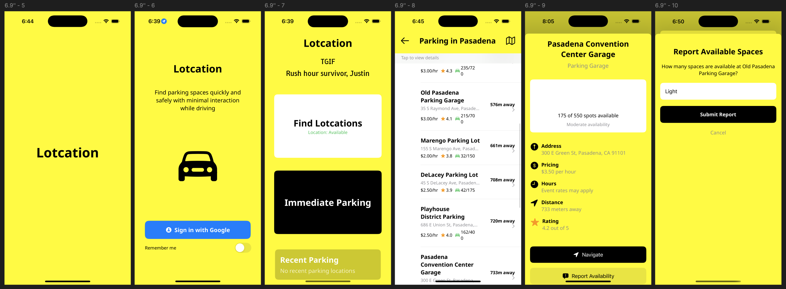

# Lotcation

**Lotcation** (Parking **Lot** + Lo**cation**) is an iOS app designed to help drivers find parking spaces quickly and safely with minimal interaction while driving.

## Problem Statement

Finding parking in busy urban areas can be stressful and distracting for drivers. Most parking apps require too much interaction, creating safety risks while driving. I hope this app can solve this problem by providing a streamlined, minimal-touch interface designed specifically for use while on the road.

## Technical Details

- Built with **SwiftUI** for modern iOS interfaces
- Custom animations for enhanced user experience
- Focused on **safe driving** by minimizing required interactions
- Intelligent greeting system based on time of day and day of week
- Google Sign-in integration for personalized experience
- Apple Maps integration for navigation to parking locations

## Project Architecture

The project follows a Service-Oriented Architecture with MVC elements:

### UI Layer (View)
- SwiftUI-based views for all user interfaces
- Large, clear buttons designed for minimal distraction while driving
- Personalized greetings based on time of day and day of week
- Status indicators for location permissions and availability

### Service Layer (Controller/Business Logic)
- Manager classes handling core functionality
- Authentication services for Google sign-in
- Location management with appropriate permission handling
- Parking data services with mock implementation for development

### Data Flow
- User Input → SwiftUI Views → Service Classes → UI Updates
- External Data → Service Classes → State Updates → UI Reflection

## Key Features

- **Custom Splash Screen Animation**: Creative branding animation that combines "Parking Lot" and "Location" into "Lotcation"
- **Day & Time-based Greetings**: Contextual messages based on time of day and weekday
- **Driver-focused UI**: Large, high-contrast buttons that minimize eyes-off-road time
- **Immediate Parking Button**: Provides one-touch navigation to the nearest available parking spot, minimizing driver distraction
- **Recent Parking**: Displays user's parking history for quick access to frequently used locations

## Project Structure

The project follows a classic Swift/SwiftUI pattern with clear separation of concerns:

Lotcation/
- Config/ - Configuration files
  - APIKeys
- Lotcation/ - Main application code
  - Models/ - Data models (in development)
  - Preview Content/ - Assets for SwiftUI preview
  - Services/ - Network and service layer
  - Utilities/ - Helper functions and extensions
  - Views/ - SwiftUI views
    - SplashScreenView
    - APIConfig
    - AppDelegate
    - Assets
    - AuthenticationManager
    - ContentView
    - Extensions
    - GoogleSignInButton
    - Info
    - LocationManager
    - LotcationApp
    - MockParkingService
    - ParkingLocationsView
    - ParkingModel
- LotcationTests/ - Unit tests
- LotcationUITests/ - UI tests

### Package Dependencies
- AppAuth 1.7.6
- AppCheck 11.2.0
- GoogleMaps 7.2.0
- GoogleSignIn 8.0.0
- GoogleUtilities 8.0.2
- GTMAppAuth 4.1.1
- GTMSessionFetcher 3.5.0
- Promises 2.4.0

## Current Status & Roadmap

### Current Status
- Initial target market: Pasadena, California
- Custom splash screen animation implemented
- Main interface with contextual greetings and parking finder buttons complete
- Location permission handling and status indicators implemented
- Mock parking data service for Pasadena area

### Technical Challenges & Next Steps
- Improving location precision for better navigation experiences
- Integrating crowdsourced parking availability reporting system
- Exploring cost-effective alternatives to Google Places API for accurate parking information
- Future planned expansion: broader Los Angeles County and San Francisco Bay Area
- Planned Apple Sign-in integration

---
*Lotcation is currently in active development. (Updated Apr 2nd 2025)*
